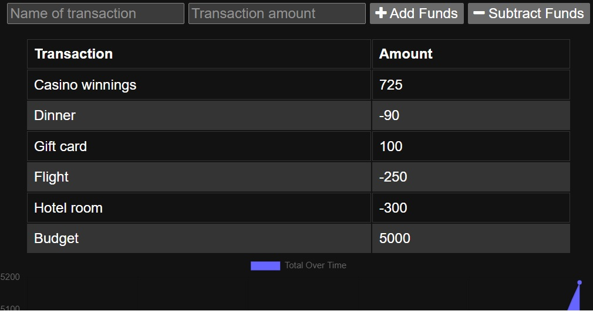

# 19-PWA-Budget-Tracker

## Use

[Live Application](https://mighty-crag-64966.herokuapp.com/)

Visit the above link to use the application. You can also click the download button in the address bar to install the app as a Progressive Web Application (PWA).

## Features

The app allows you to keep track of invcome and expenses, and automatically draws a line graph of your total money over the course of transactions. This graph serves as a notification to the fact that the user has added a transaction.

Once initially loaded, the app can endure periods of poor internet connectivity. It will store transaction data using browser-based indexedDB, and then upload transactions upon reconnecting to the internet.

You can use the app as a Progressive Web Application (PWA), which resembles a native app in appearence.

## Future Development

The ability to remove transactions would be a good feature to add to this application. It would require new front end functions as well as new API routes. If you are interested in collaborating, please reach out to me at ddoherty6@gmail.com.